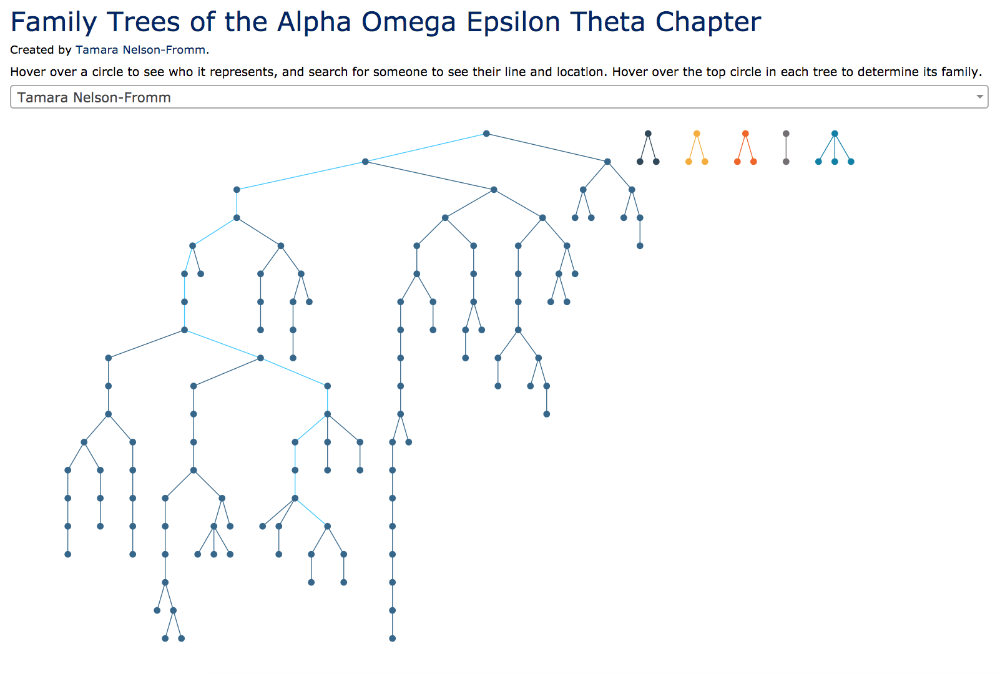

# A.O.E. families
## Background
Created to display the family trees of University Of Illinois' Theta Chapter of Alpha Omega Epsilon. All separated "families" are displayed in different colors, and all nodes are searchable to find the location of a specific member.

## To Fork

All members to be displayed must be inserted as a row in a CSV with the columns "Little" and "Big." All members must appear as a little. All founding members or family heads should be assigned the big "Founder," and Founder must have its own column as a little.

For example, if your chapter has two founders Anna and Grace, and Grace has a little named Kat, your csv would read as follows:

| Little  | Big     |   |   |   |
|---------|---------|---|---|---|
| Founder |         |   |   |   |
| Anna    | Founder |   |   |   |
| Grace   | Founder |   |   |   |
| Kat     | Grace   |   |   |   |

This csv should be named `FamilyTrees.csv` and inserted in the main directory.

Optionally, the colors of the trees and the search highlight can be changed by modifying the variables 'colors' and 'highlightColors' in `familytree.js`.
